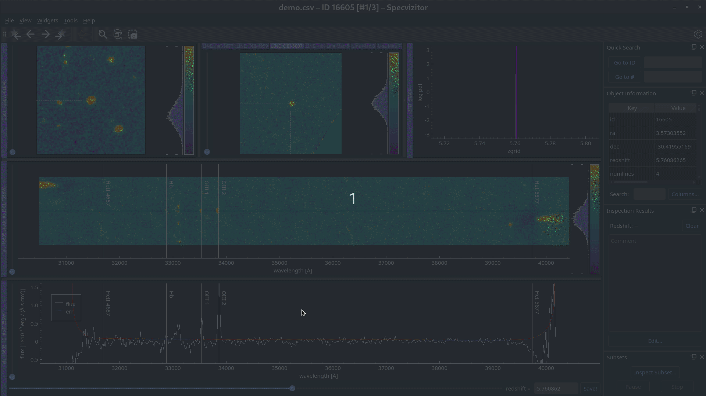

Welcome to specvizitor's documentation!
=======================================

.. toctree::
    :hidden:
    :maxdepth: 2

    getting-started
    userguide/index
    development/index
    citation/index
    Changelog <https://github.com/ivkram/specvizitor/releases>

Specvizitor is a graphical desktop application for a visual inspection of astronomical spectroscopic data. Its main features are:

- Interactive data widgets, including a redshift slider;
- A dedicated widget for object classification & comments;
- Support for various data formats (FITS, ASCII, TIFF, ...);
- A fully customizable user interface.

Navigate to the :doc:`getting-started` section to learn how you can install and use specvizitor.

