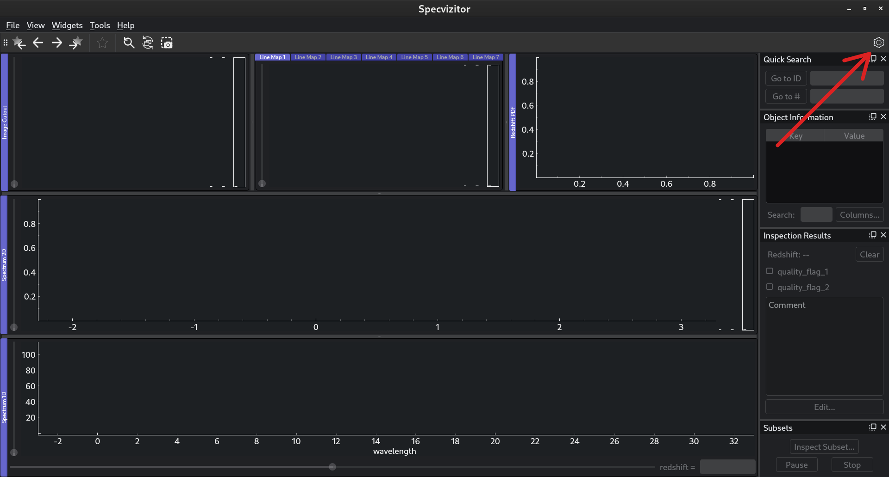

Application settings
====================

Basic settings
++++++++++++++

Some basic settings such as the data path are available in :menuselection:`Tools --> Settings`. You can also access :guilabel:`Settings` by clicking on the cogwheel in :guilabel:`Toolbar`:

:guilabel:`Settings` comprises the following sections:

.. list-table::
    :header-rows: 1
    :widths: auto

    * - Section
      - Purpose
    * - :guilabel:`Appearance`
      - Change the application theme, configure antialiasing [#f1]_
    * - :guilabel:`Catalog`
      - Load the catalog
    * - :guilabel:`Data Source`
      - Specify the path to the data folder

Any changes will take effect immediately once you click :guilabel:`OK`.

Advanced settings
+++++++++++++++++

To access advanced settings, open the directory indicated in the bottom of :guilabel:`Settings` (under the "Advanced settings").
For example, in Linux this directory will be ``$HOME/.config/specvizitor``.
There you will find the following `YAML <https://yaml.org>`_ files:

.. list-table::
    :header-rows: 1
    :widths: auto

    * - File
      - Purpose
    * - ``config.yml``
      - General application settings
    * - ``data_widgets.yml``
      - Widget configurations
    * - ``spectral_lines.yml``
      - The list of spectral lines displayed in the GUI

.. rubric:: Footnotes

.. [#f1] Enabling antialiasing might decrease the GUI responsiveness.

