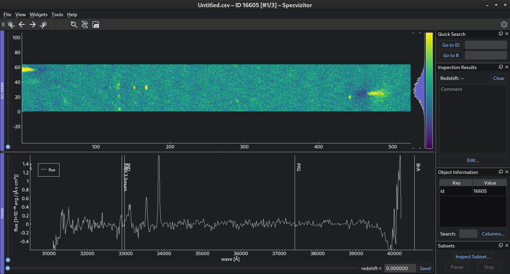

Data Viewer
===========

.. important::

    This section assumes that the reader is already familiar with :doc:`app-settings`.

Introduction
++++++++++++

By default, the data viewer in specvizitor is configured to display the `Grizli <https://github.com/gbrammer/grizli>`_ data products. Specifically, it is using data from the following files:

.. list-table::
    :header-rows: 1
    :widths: auto

    * - File
      - Description
    * - ``*1D.fits``
      - 1D spectrum
    * - ``*stack.fits``
      - 2D stacked spectrum of all exposures
    * - ``*full.fits``
      - Various extraction products including emission line maps and image cutouts

However, specvizitor's capabilities go far beyond this. By modifying the ``data_widgets.yml`` file, you can create a custom widget configuration tailored to practically *any* spectroscopic dataset. In this section, you will learn how to configure data widgets in specvizitor, starting with small tweaks to the default configuration and finishing with a configuration "from scratch".

Configuring the default widgets
+++++++++++++++++++++++++++++++

Let us start with some examples of how you can configure the default data widgets.

Changing the redshift range
^^^^^^^^^^^^^^^^^^^^^^^^^^^

In ``data_widgets.yml``, navigate to ``plots`` ‣ ``Spectrum 1D`` ‣ ``redshift_slider`` ‣ ``max_value``::

      ...
      plots:
        Spectrum 1D:
          ...
          redshift_slider:
            ...
            max_value: 10

Set ``max_value`` to any redshift you think would suffice to classify even the most distant objects included in your sample. Next, make the same changes to the redshift slider under ``images`` ‣ ``Spectrum 2D``::

      images:
        ...
        Spectrum 2D:
          ...
          redshift_slider:
            ...
            max_value: 10

This is required because :guilabel:`Spectrum 1D` and :guilabel:`Spectrum 2D` share the same redshift. Once you have made the changes, save ``data_widgets.yml`` and launch specvizitor. The maximum value of the redshift slider should be updated accordingly.

Changing the color bar range
^^^^^^^^^^^^^^^^^^^^^^^^^^^^

.. note::

    This example demonstrates how to change the color bar range of :guilabel:`Spectrum 2D`, however the same applies to any widget in the ``images`` category.

In ``data_widgets.yml``, navigate to ``images`` ‣ ``Spectrum 2D`` ‣ ``color_bar`` ‣ ``limits``::

      images:
        ...
        Spectrum 2D:
          ...
          color_bar:
            ...
            limits:
              min: -0.015
              max: 0.015
              type: user

Here, you can set the ``min`` and ``max`` parameters of the color bar. Once you have made the changes, save ``data_widgets.yml`` and launch specvizitor. The color bar range in :guilabel:`Spectrum 2D` should be updated accordingly.

Linking widget elements
^^^^^^^^^^^^^^^^^^^^^^^

.. note::
    This example demonstrates how to link plot axes, however the same applies to sliders and color bars.

In ``data_widgets.yml``, navigate to ``images`` ‣ ``Line Map 1`` ‣ ``x_axis`` ‣ ``link_to``::

      images:
        ...
        Line Map 1:
          ...
          x_axis:
            link_to: null

Set ``link_to`` to ``Image Cutout``. Once you have made the changes, save ``data_widgets.yml`` and launch specvizitor. The y-axis of ``Image Cutout`` and ``Line Map 1`` should be linked together.

Hiding widget elements
^^^^^^^^^^^^^^^^^^^^^^

.. note::

    This example demonstrates how to change the visibility of plot axes, however the same applies to color bars, sliders, spectral lines, and widgets themselves.

.. tip::

    Most of the widget elements can be hidden simultaneously by pressing :kbd:`H`.

In ``data_widgets.yml``, navigate to ``images`` ‣ ``Spectrum 2D`` ‣ ``x_axis`` ‣ ``visible``::

      images:
        ...
        Spectrum 2D:
          ...
          x_axis:
            visible: true

Set ``visible`` to ``false``, save ``data_widgets.yml`` and launch specvizitor. The :guilabel:`Spectrum 2D`'s x-axis will disappear from the view.

Adding new widgets
++++++++++++++++++

Let us continue with some examples of how you can add new widgets to the data viewer.

Widget types
^^^^^^^^^^^^

There are two types of widgets that can be added to the data viewer --- images and plots::

    images:
      ...
    plots:
      ...

Both ``images`` and ``plots`` can comprise multiple items::

    images:
      Image:
        ...
      Spectrum 2D:
        ...
    plots:
      Plot:
        ...
      Plot 2:
        ...
      Another Plot:
        ...

.. important::

    All widget names must be unique.

The difference between ``images`` and ``plots`` lies in the parameters that widgets of these types can have. For example, the ``color_bar`` parameter is unique to widgets listed in ``images``, and the ``plots`` parameter is unique to widgets listed in ``plots``.

Adding an image
^^^^^^^^^^^^^^^

This is a minimal example of ``data_widgets.yml`` comprising a single image::

    images:
      Image Cutout:
        data:
          filename_keyword: stack.fits

Here, by specifying the ``filename_keyword`` parameter, we tell specvizitor to search for files whose filenames include ``stack.fits``. For example, if we load the dataset from the tutorial (see :doc:`../getting-started`), specvizitor will discover the following files::

    alt_16605.stack.fits
    alt_26932.stack.fits
    alt_34927.stack.fits

and select one of them depending on the ID of the current object.

Sometimes a FITS file contains multiple images (tables). By default, specvizitor loads the first image (table) from such files. To load a different image (table), we can specify the ``extname`` and ``extver`` parameters in ``loader_params``::

    images:
      Image Cutout:
        data:
          filename_keyword: stack.fits
          loader_params:
            extname: SCI
            extver: F356W

Finally, it is often useful to configure the default range of the color bar attached to the image::

    images:
      Image Cutout:
        data:
          filename_keyword: stack.fits
          loader_params:
            extname: SCI
            extver: F356W
        color_bar:
          limits:
            type: user
            min: -0.015
            max: 0.015

Here, ``type`` mimics the types of images limits used in `SAOImage DS9 <https://github.com/SAOImageDS9/SAOImageDS9/>`_ and can be either ``user`` (in which case it is necessary to specify ``min`` and ``max``), ``minmax`` (the default value), or ``zscale``.

Adding a plot
^^^^^^^^^^^^^

Similarly to ``images``, this is a minimal example of ``data_widgets.yml`` comprising a single widget for displaying plots::

    plots:
      Spectrum 1D:
        data:
          filename_keyword: 1D.fits

Next, we need to specify the plot(s) that will be shown in this widget::

    plots:
      Spectrum 1D:
        data:
          filename_keyword: 1D.fits
        plots:
          flux:
            x: wave
            y: flux

Here, ``wave`` and ``flux`` refer to the columns of a table loaded from the FITS file.

In addition, we might want to configure the plot limits::

    plots:
      Spectrum 1D:
        data:
          filename_keyword: 1D.fits
        plots:
          flux:
            x: wave
            y: flux
        y_axis:
          limits:
            min: -0.5
            max: 1.5

Finally, let us add a redshift slider to the widget and make spectral lines visible in the plot::

    plots:
      Spectrum 1D:
        data:
          filename_keyword: 1D.fits
        plots:
          flux:
            x: wave
            y: flux
        y_axis:
          limits:
            min: -0.5
            max: 1.5
        redshift_slider:
          visible: true
          max_value: 10
          step: 1.0e-6
          catalog_name: redshift
          show_text_editor: true
          show_save_button: true
        spectral_lines:
          visible: true

A full example
^^^^^^^^^^^^^^

This is a full example of ``data_widgets.yml`` which combines the two previous examples::

    images:
      Image Cutout:
        data:
          filename_keyword: stack.fits
          loader_params:
            extname: SCI
            extver: F356W
        color_bar:
          limits:
            type: user
            min: -0.015
            max: 0.015
    plots:
      Spectrum 1D:
        data:
          filename_keyword: 1D.fits
        plots:
          flux:
            x: wave
            y: flux
        y_axis:
          limits:
            min: -0.5
            max: 1.5
        redshift_slider:
          visible: true
          max_value: 10
          step: 1.0e-6
          catalog_name: redshift
          show_text_editor: true
          show_save_button: true
        spectral_lines:
          visible: true

If you load this file in specvizitor (:menuselection:`Widgets --> Restore...`), you should see the following:

.. note::
    The widget configuration used in specvizitor *by default* is available `here <https://github.com/ivkram/specvizitor/blob/main/specvizitor/data/presets/data_widgets.yml>`_.

Templates
+++++++++

TBU
