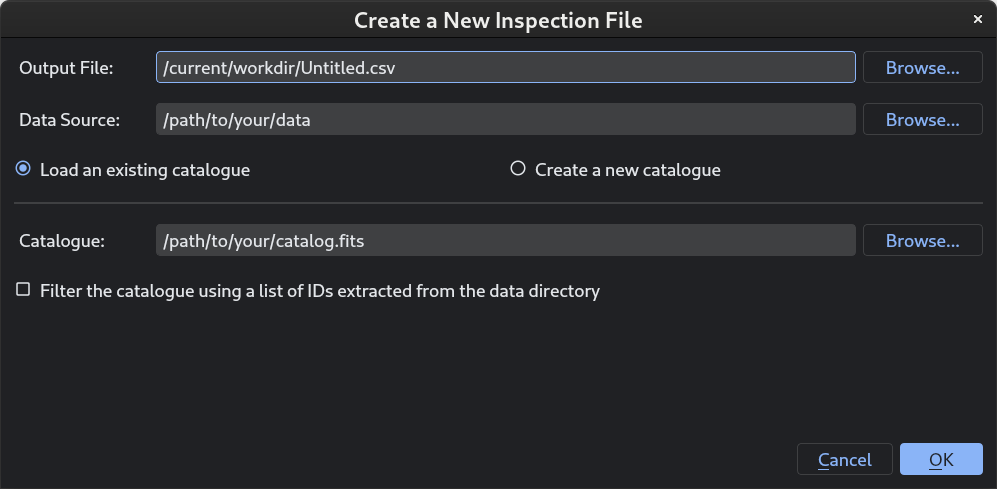
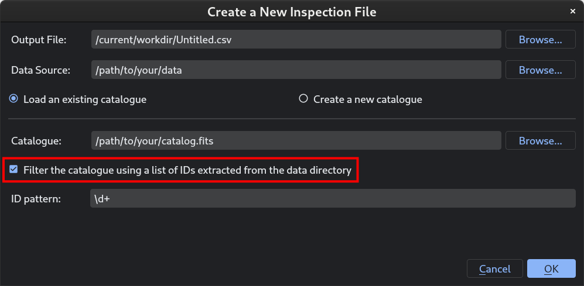
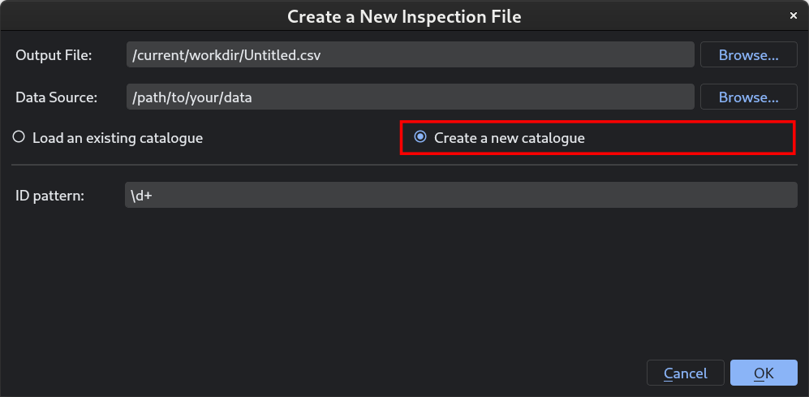
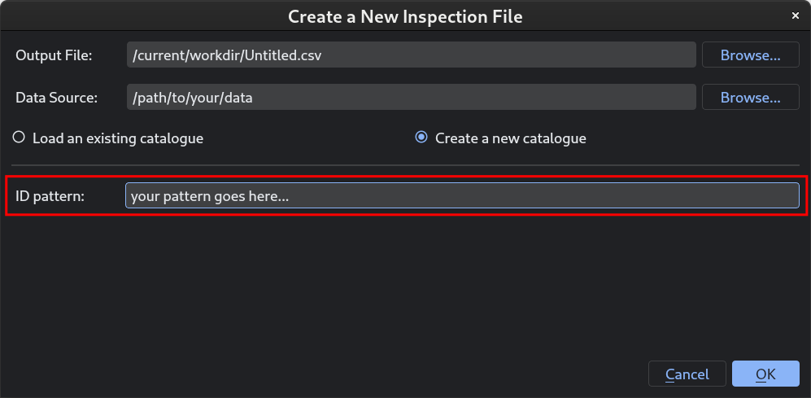
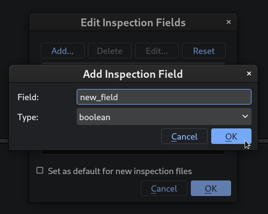
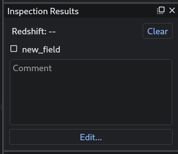
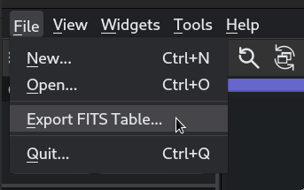

Inspection Basics
=================

Creating a new inspection file
++++++++++++++++++++++++++++++

Every round of inspections starts with creating a new *inspection file*. To get started, navigate to :menuselection:`File --> New...`:

**First**, specify the name of the output file. This is the file where specvizitor stores the results of inspections (redshifts, for example). Specifically, it comprises at least the following columns:

.. list-table::
    :header-rows: 1
    :widths: auto

    * - Column
      - Description
    * - ``id``
      - IDs under inspection
    * - ``starred``
      - ``True`` if an object is starred by the user, otherwise ``False``
    * - ``z_sviz``
      - Redshifts saved in :guilabel:`Inspection Results`
    * - ``comment``
      - Comments added in :guilabel:`Inspection Results`

The output file (also known as the *inspection file*) is stored in the comma-separated values (CSV) format, enabling a quick access to the inspection results from any text editor. Optionally, you can export the inspection results as a FITS table (see :ref:`export-fits-table`).

**Second**, specify the path to the data directory. The files stored in the data directory must contain object IDs in their filenames, otherwise the files will not be discovered. Apart from that, there are no special requirements to the filenames.

.. tip::
    Currently, specvizitor works with only a single data directory at a time. If your files are spread across different directories, consider moving them into a single directory. Alternatively, you could specify a path to the top-level directory and enable recursive search (see :doc:`app-settings`), however this might slow down the discovery of the data files.

**Third**, you can optionally specify the path to the catalog with some additional information about the objects you are inspecting (photometric redshifts, for example). This information will appear in :guilabel:`Object Information` in the main window.

All IDs found in the catalog will become part of the inspection file even if the respective data files are not found. To avoid having such IDs in the inspection file, select the checkbox at the bottom of the window.

.. note::
    Knowing that astronomical catalogs always use different names for the same columns (examples include "id", "ID", "NUMBER"), a list of aliases for common column names has been added to specvizitor. This list is extensive but, by no means, exhaustive. Thankfully, you can always add more aliases in the settings (see :doc:`app-settings`).

For some quick analyses, you can skip the catalog part by selecting :guilabel:`Create a new catalog`:

This creates a dummy catalog comprising a single column of object IDs that are automatically extracted from the filenames of the files found in the data directory. For each filename, specvizitor extracts an ID by finding the longest substring of digits, which is done by matching a particular regular expression (RegEx) pattern (``\d+``) to the filename. You can change this behaviour by modifying the regex pattern in the same the window:

.. note::
    Some features of the data viewer work only if certain columns are discovered in the catalog. In particular, cutouts from astronomical images can be created only if object coordinates (``RA`` and ``Dec``) are present in the catalog.

Once you have gone through all these steps, click :guilabel:`OK`. If there are no errors, a new inspection file will be created.

Adding inspection fields
++++++++++++++++++++++++

In specvizitor, you can create custom inspection fields for carrying out some additional classification besides just assigning a redshift, for example assigning *a confidence level* to the redshift or marking objects with some unusual properties. To create a new inspection field, navigate to :guilabel:`Inspection Results` ‣ :guilabel:`Edit...` ‣ :guilabel:`Add...` and enter the name of a new field:

Click :guilabel:`OK` (twice). The new field will appear in :guilabel:`Inspection Results`:

This field will also appear as a boolean column in the output file (``*.csv``).

.. note::
    At any time, inspection fields can be renamed or deleted using the same editor. If you attempt to delete an inspection field that contains some data, you will be prompted to confirm this action.

Saving inspection results
+++++++++++++++++++++++++

The inspection results (``*.csv``) are saved *automatically* whenever you:

* go from one object to another;
* exit the application (close the window, navigate to :menuselection:`File --> Quit`, or press :kbd:`Ctrl+Q`).

By design, there is no *manual* way to save the inspection results. The :kbd:`Ctrl+S` shortcut updates the redshift in :guilabel:`Inspection Results` only, and for the ``*.csv`` file to be saved you still need to trigger one of the two events listed above.

.. _export-fits-table:

Exporting a FITS table
++++++++++++++++++++++

Sometimes it might be useful to export the inspection results (``*.csv``) as a FITS table (for example, to load them in Astropy). This can be done by navigating to :menuselection:`File --> Export FITS Table...` and specifying the path to the output file:

