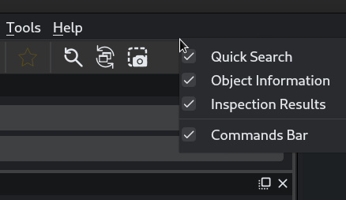

Troubleshooting
===============

Specvizitor won't launch
++++++++++++++++++++++++

If you run specvizitor for the first time, you might encounter the following error::

        ...
        TypeError: unsupported operand type(s) for |: 'type' and 'NoneType'

This means that you are using an older version of Python than the version required to run specvizitor (3.10 and higher). You can install Python 3.10+ using `conda <https://conda.io/projects/conda/en/latest/user-guide/getting-started.html>`_, for example.

Widget(s) disappeared from the GUI
++++++++++++++++++++++++++++++++++

If a sidebar widget (e.g., :guilabel:`Object Information`) has disappeared from the GUI and you want to bring it back, right click on the empty area in :guilabel:`Toolbar` or :guilabel:`Menu` and click on that widget from the dropdown menu:

What to do if none of the above helped
++++++++++++++++++++++++++++++++++++++

1. Check the console output - error messages can help you to pinpoint the exact source of the problem.

2. `Update specvizitor <../gettingstarted.html#updating-specvizitor>`__ - some bugs might have been fixed in the latest version.

3. Reset specvizitor to its initial state::

        specvizitor --purge

.. warning::

        Running specvizitor with the ``--purge`` option will erase user-defined paths, custom widget configurations and other application settings.

.. note::

        Running specvizitor with the ``--purge`` option will NOT affect any inspection files (``*.csv``).

4. `Open issue on GitHub <https://github.com/ivkram/specvizitor/issues/new?title=Issue%20on%20page%20%2Fuserguide/troubleshooting.html&body=Your%20issue%20content%20here.>`_.

